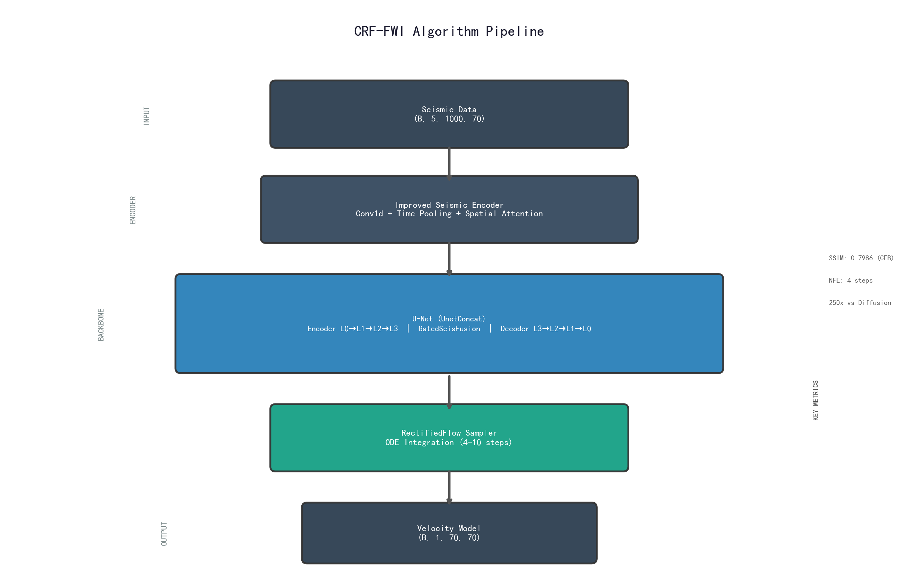
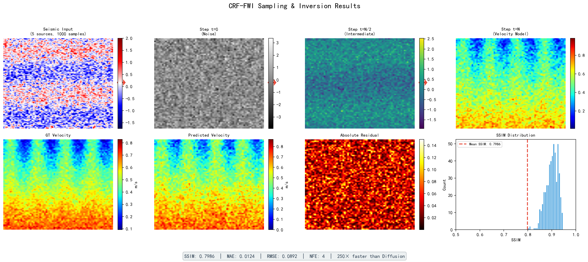

# CRF-FWI: Conditional Rectified Flow for Seismic Full-Waveform Inversion

[](https://www.python.org/downloads/)
[](https://pytorch.org/)
[](LICENSE)

**CRF-FWI** is the first framework to apply **Conditional Rectified Flow** to seismic full-waveform inversion (FWI). By "straightening" the transport path between noise and velocity models, CRF-FWI achieves state-of-the-art inversion accuracy while requiring only **4 neural function evaluations (NFEs)** — a **250× reduction** from standard diffusion models.

> 📄 **Paper**: *Conditional Rectified Flow for End-to-End Fast Seismic Full-Waveform Inversion*  
> 🏫 **Affiliation**: School of Geophysics, Yangtze University  
> 👥 **Authors**: Haofei Xu, Wei Cheng, Sizhe Li, Jie Xiong

---

## Key Results

| Dataset | Metric | Score |
|---------|--------|-------|
| CurveFault-B (OpenFWI) | SSIM | **0.7986** |
| FlatFault-B (OpenFWI) | SSIM | **0.9177** |
| Volve Field (Realistic) | SSIM | **0.9859** |
| Volve Field @ SNR 3dB | SSIM | **0.9608** |

- **250× fewer sampling steps** than diffusion models (4 NFEs vs. 1,000)
- **Stable quality** across NFE range [4, 1000] (SSIM fluctuation < ±0.003)
- **Robust to noise**: only 25–30% degradation at extreme SNR compared to competing methods

---

## Architecture Overview



**RectifiedFlow Sampler** integrates ODE from noise to velocity model using the trained U-Net as a velocity field predictor.

---

## Sampling & Inversion Demo



## Project Structure

| File | Description |
|------|-------------|
| `model.py` | RectifiedFlow sampler & schedulers |
| `unet.py` | U-Net backbone (UnetConcat) with seismic conditioning |
| `ssim_improments.py` | ImprovedSeisEncoder, TimePooling, SpatialAttention, LearningRateController, ConvSeisAligner |
| `noise.py` | 14 types of seismic noise simulation |
| `train_1.py` | Training script (CFB dataset) |
| `test_ssim.py` | Evaluation script with SSIM/MAE/RMSE metrics |
| `requirements` | Python dependencies |
| `utils/OptimizedSeisDataset.py` | Efficient dataset loader with memory mapping |
| `utils/test_data_slicer.py` | Test data loading utilities |
| `utils/drop.py` | DropPath (Stochastic Depth) |
| `utils/__init__.py` | Package init |

### Core Components

| File | Description |
|------|-------------|
| `model.py` | RectifiedFlow sampler with LogitNormalCosine and Linear schedulers. Implements ODE integration with optional median correction. |
| `unet.py` | Modified U-Net that conditions on seismic data via GatedSeisFusion at each encoder/decoder level. Uses ConvSeisAligner for spatial alignment and EnhancedTimeMLP for time embeddings. |
| `ssim_improments.py` | Seismic encoder with Conv1d temporal processing, learnable time pooling, spatial attention, and multi-source fusion. Also includes the LearningRateController with cosine annealing and warm-restart. |
| `noise.py` | Comprehensive noise simulation toolkit supporting 14 noise types for robust testing. |
| `train_1.py` | End-to-end training pipeline with Comet ML logging, EMA updates, mixed-precision training, and periodic evaluation. |
| `test_ssim.py` | Evaluation script computing SSIM, MAE, and RMSE metrics with visualization of predictions, ground truth, and residuals. |

---

## Installation

### Requirements

- Python 3.10+
- CUDA 12.1 (recommended)

### Setup

```bash
# Clone the repository
git clone https://github.com/YOUR_USERNAME/crf-fwi.git
cd crf-fwi

# Install PyTorch (CUDA 12.1)
pip install torch==2.4.1 --index-url https://download.pytorch.org/whl/cu121

# Install other dependencies
pip install einops timm comet_ml moviepy matplotlib scikit-image
```

---

## Usage

### Training

```bash
python train_1.py
```

The training script expects data in the following structure:
```
/openfwi/data/
├── vmodel/          # Velocity model .npy files
└── seis/            # Seismic data .npy files
    └── test_data/   # Test data for evaluation
```

Key training hyperparameters (configurable in `train_1.py`):
- `n_steps = 100000` — Total training steps
- `batch_size = 64`
- `learning_rate = 3e-4` (with cosine annealing)
- `ema_decay = 0.9999`
- `image_size = 70`

### Evaluation

1. Update paths in `test_ssim.py`:
   - `WEIGHT_PATH` — Path to trained model checkpoint (`.pth`)
   - `DATA_DIR` — Path to test data directory

2. Run evaluation:
```bash
python test_ssim.py
```

The script computes SSIM, MAE, and RMSE metrics and generates a visualization of predictions vs. ground truth.

### Noise Simulation

The `noise.py` module provides 14 types of seismic noise for robust testing:

| # | Function | Description |
|---|----------|-------------|
| 1 | `add_gaussian_noise` | Gaussian white noise |
| 2 | `add_uniform_noise` | Uniform distribution noise |
| 3 | `add_surface_wave` | Surface wave (linear coherent) |
| 4 | `add_ground_roll` | Ground roll (dispersive surface wave) |
| 5 | `add_multiples` | Multiple reflections (periodic) |
| 6 | `add_power_line_noise` | 50/60 Hz power line interference |
| 7 | `add_harmonic_noise` | Harmonic interference |
| 8 | `add_dead_traces` | Dead traces (zeroed channels) |
| 9 | `add_noisy_traces` | Bad traces (high-noise channels) |
| 10 | `add_spike_noise` | Spike/salt-and-pepper noise |
| 11 | `add_band_limited_noise` | Band-limited random noise |
| 12 | `add_low_freq_noise` | Low-frequency noise |
| 13 | `add_correlated_noise` | Spatially correlated noise |
| 14 | `add_realistic_field_noise` | Combined realistic field noise |

All functions support both NumPy and PyTorch tensors with arbitrary batch shapes.

Usage example:
```python
from noise import add_realistic_field_noise

noisy_seis = add_realistic_field_noise(seis_data, snr_db=5)
```

---

## Dataset

This project uses the **OpenFWI** dataset for training and evaluation. OpenFWI is a large-scale, multi-structural benchmark dataset for seismic full-waveform inversion.

- **Training**: CurveFault-B (CFB) dataset
- **Testing**: All 8 OpenFWI benchmark categories
- **Real-world validation**: Volve field data

For dataset access, refer to the [OpenFWI website](https://openfwi-lanl.github.io/).

---

## Key Technical Innovations

1. **Rectified Flow for FWI** — First application of flow matching to seismic inversion, reducing sampling steps from 1000 to 4.

2. **Improved Seismic Encoder** — Conv1d temporal processing with learnable time pooling and spatial attention for better seismic feature extraction.

3. **Gated Seis Fusion** — Spatial gating mechanism that adaptively blends seismic conditioning with U-Net features at each resolution level.

4. **Comprehensive Noise Simulation** — 14 noise types for rigorous robustness evaluation under realistic field conditions.

---

## Citation

If you use this code in your research, please cite our paper:

```bibtex
@article{xu2025crffwi,
  title={Conditional Rectified Flow for End-to-End Fast Seismic Full-Waveform Inversion},
  author={Xu, Haofei and Cheng, Wei and Li, Sizhe and Xiong, Jie},
  journal={Remote Sensing},
  year={2025},
  publisher={MDPI}
}
```

---

## License

This project is licensed under the MIT License — see the [LICENSE](LICENSE) file for details.

---

## Contact

**Jie Xiong** (Corresponding Author)  
School of Geophysics, Yangtze University  
Wuhan, Hubei 430100, China  
Email: xiongjie@yangtzeu.edu.cn
